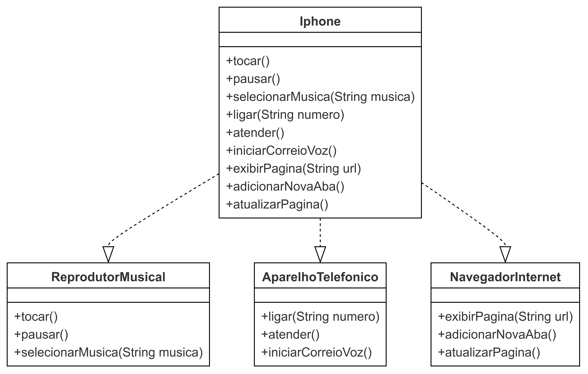

# Desafio: Modelagem de Componente iPhone

## Contexto

Neste desafio, aplicamos conceitos de **Programação Orientada a Objetos (POO)** para modelar e diagramar um componente representando o iPhone. A modelagem foi baseada em três funcionalidades principais:
- Reprodutor Musical
- Aparelho Telefônico
- Navegador de Internet

As funcionalidades foram organizadas em interfaces e implementadas em uma classe principal chamada `Iphone`. Esta abordagem promove a reutilização de código e segue os princípios de POO, como encapsulamento e abstração.

## Objetivo

1. Criar um **diagrama UML** que represente as funcionalidades descritas acima.
2. Implementar as classes e interfaces correspondentes em Java.

## Diagrama UML

Abaixo está a representação UML da estrutura de classes e interfaces do projeto:



## Estrutura do Projeto

O projeto está organizado em pacotes, seguindo as boas práticas de organização de código em Java:

- **Pacote principal**: `com.iphone`
    - **Interfaces**:
        - `ReprodutorMusical`: Define métodos para reproduzir, pausar e selecionar músicas.
        - `AparelhoTelefonico`: Define métodos para fazer chamadas, atender e iniciar o correio de voz.
        - `NavegadorInternet`: Define métodos para exibir páginas, adicionar novas abas e atualizar a página.
    - **Classe Principal**:
        - `Iphone`: Implementa as três interfaces e fornece a funcionalidade completa do componente iPhone.

## Código das Interfaces e Classe Principal

### Interface ReprodutorMusical
```java
package com.iphone;

public interface ReprodutorMusical {
    void tocar();
    void pausar();
    void selecionarMusica(String musica);
}
```

### Interface AparelhoTelefonico
```java
package com.iphone;

public interface AparelhoTelefonico {
    void ligar(String numero);
    void atender();
    void iniciarCorreioVoz();
}
```

### Interface NavegadorInternet
```java
package com.iphone;

public interface NavegadorInternet {
    void exibirPagina(String url);
    void adicionarNovaAba();
    void atualizarPagina();
}
```

### Classe Iphone
```java
package com.iphone;

public class Iphone implements ReprodutorMusical, AparelhoTelefonico, NavegadorInternet {

    @Override
    public void tocar() {
        System.out.println("Tocando música...");
    }

    @Override
    public void pausar() {
        System.out.println("Música pausada.");
    }

    @Override
    public void selecionarMusica(String musica) {
        System.out.println("Selecionando música: " + musica);
    }

    @Override
    public void ligar(String numero) {
        System.out.println("Ligando para: " + numero);
    }

    @Override
    public void atender() {
        System.out.println("Atendendo chamada...");
    }

    @Override
    public void iniciarCorreioVoz() {
        System.out.println("Iniciando correio de voz.");
    }

    @Override
    public void exibirPagina(String url) {
        System.out.println("Exibindo página: " + url);
    }

    @Override
    public void adicionarNovaAba() {
        System.out.println("Adicionando nova aba.");
    }

    @Override
    public void atualizarPagina() {
        System.out.println("Atualizando página.");
    }
}
```

## Como Executar o Projeto

Para executar o projeto, siga estas etapas:

1. Certifique-se de que o **JDK** está instalado e configurado no seu ambiente.
2. Clone o repositório para o seu ambiente local.
3. Abra o projeto no **IntelliJ IDEA** ou em outro editor de sua preferência.
4. Execute a classe de teste `IphoneTest` para verificar o funcionamento dos métodos implementados.

### Classe de Teste IphoneTest
```java
package com.iphone;

public class IphoneTest {
    public static void main(String[] args) {
        Iphone iphone = new Iphone();

        // Testando Reprodutor Musical
        iphone.tocar();
        iphone.pausar();
        iphone.selecionarMusica("Imagine - John Lennon");

        // Testando Aparelho Telefônico
        iphone.ligar("123-456-7890");
        iphone.atender();
        iphone.iniciarCorreioVoz();

        // Testando Navegador Internet
        iphone.exibirPagina("https://www.example.com");
        iphone.adicionarNovaAba();
        iphone.atualizarPagina();
    }
}
```

## Referências

- [Vídeo de lançamento do iPhone 2007](https://www.youtube.com/watch?v=9ou608QQRq8) (Minutos relevantes: 00:15 até 00:55)

## Conclusão

Este projeto demonstrou a aplicação prática de conceitos de POO e UML, implementando funcionalidades inspiradas nas capacidades do iPhone de 2007. Essa modelagem reflete uma abordagem orientada a objetos modular, facilitando a compreensão e manutenção do código.
